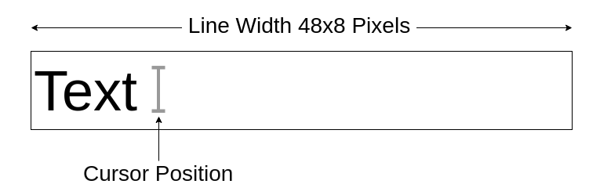

## Table Of Contents
- [Table Of Contents](#table-of-contents)
- [Introduction](#introduction)
- [Definitions](#definitions)
- [Getting Started](#getting-started)
- [Functions](#functions)
  - [Function List](#function-list)
  - [int printerStatus()](#int-printerstatus)
  - [int cursorPosition()](#int-cursorposition)
  - [void setCursorPosition(int pos);](#void-setcursorpositionint-pos)
  - [void setFontFace(int font)](#void-setfontfaceint-font)
  - [void setFontSize(int fontSize)](#void-setfontsizeint-fontsize)
  - [void addTextToLine(String text, Alignment alignment)](#void-addtexttolinestring-text-alignment-alignment)
  - [void printLine()](#void-printline)
  - [void drawLine(int thickness, int verticalMargin, int horizontalMargin)](#void-drawlineint-thickness-int-verticalmargin-int-horizontalmargin)
  - [void printText(String text)](#void-printtextstring-text)
  - [void printBitmap(String name, int verticalMargin)](#void-printbitmapstring-name-int-verticalmargin)
  - [void printBitmap(Context context, byte[] bitmapArray)](#void-printbitmapcontext-context-byte-bitmaparray)
  - [void addSpace(int pixelHeight)](#void-addspaceint-pixelheight)
  - [void addEmptyLines(float lines)](#void-addemptylinesfloat-lines)
  - [float lineSpacing()](#float-linespacing)
  - [void setLineSpacing(float f)](#void-setlinespacingfloat-f)
  - [int printDensity()](#int-printdensity)
  - [void setPrintDensity(int density)](#void-setprintdensityint-density)
  - [void printExternalBitmap(byte[] bitmapArray)](#void-printexternalbitmapbyte-bitmaparray)
  - [void printQrCode(String text, ErrorCorrectionLevel correctionLvl, int verticalMargin)](#void-printqrcodestring-text-errorcorrectionlevel-correctionlvl-int-verticalmargin)
- [Miscellaneous](#miscellaneous)
  - [Subscribing To 'Printer State Changed' Broadcast](#subscribing-to-printer-state-changed-broadcast)
- [Known Issues](#known-issues)

<br/>

## Introduction

Printer service is a service which provides a simplified api for printer related operations. This document describes usage of the available printer functions.

<br/>

## Definitions  

**Line Width:** Thermal printer has a fixed line width in pixels. It's 48x8, that is 384 pixels. It should be taken into consideration when using functions like drawLine, setCursorPosition, addTextToLine.

**Cursor Position:** Cursor position is the horizontal position where the text added by addText() function will be processed into line bitmap. It is incremented automatically.

**LineSpacing:** Vertical placement of the lines. If linespacing is 1, lines are spaced tightly, If linespacing is 1.5 there will be a half line sized gap between them etc. Line spacing cannot be less than 1.



<a id="printDensityDef"></a> 

**Print Density:** It is the setting that determines energy applied to thermal head. Inappropriate values of this setting may cause text to be too dark or indistinct. Note that use of energy also means battery drainage and heat generation. Here is a quote from original documentation of printer hardware:

>  Excessive energy may cause shortening the life of thermal head, or may cause the paper feed problem, so specify the accurate thermal paper selection and print density selection. When the using thermal paper is different from the one specified or the print density is other than 100%, the reliability of the product specification may not be satisfied. Verify the performance with your actual device before printing.

Related functions:  [printDensity](#int-printdensity),  [setPrintDensity](#void-setprintdensityint-density)

<br/>

## Getting Started

 1) Copy aar lib file from /app/libs folder into your project  
 2) Make sure you include aar lib in your Project. In this example project, it is done in /app/.build.gradle file like this:

```groovy
dependencies {
    implementation fileTree(dir: "libs", include: ["*.jar", "*.aar"])
    ...
}
```
<br/>

##  Functions


### Function List  

int [printerStatus](#int-printerstatus)()  
int [cursorPosition](#int-cursorposition)()  
void [setCursorPosition](#void-setcursorpositionint-pos)(int pos);  
void [setFontFace](#void-setfontfaceint-font)(int font)  
void [setFontSize](#void-setfontsizeint-fontsize)(int fontSize)  
void [addTextToLine](#void-addtexttolinestring-text-alignment-alignment)(String text, Alignment alignment)  
void [printLine](#void-printline)()  
void [drawLine](#void-drawlineint-thickness-int-verticalmargin-int-horizontalmargin)(int thickness, int verticalMargin, int horizontalMargin)  
void [printText](#void-printtextstring-text)(String text)  
void [printBitmap](#void-printbitmapstring-name-int-verticalmargin)(String name, int 
verticalMargin)  
void [printBitmap](#void-printbitmapcontext-context-byte-bitmaparray)(Context ctx, byte[] bitmapArray)  
void [addSpace](#void-addspaceint-pixelheight)(int pixelHeight)  
void [addEmptyLines](#void-addemptylinesfloat-lines)(float lines)  
float [lineSpacing](#float-linespacing)()  
void [setLineSpacing](#void-setlinespacingfloat-f)(float f)  
int [printDensity](#int-printdensity)()  
void [setPrintDensity](#void-setprintdensityint-density)(int density)  
void [printExternalBitmap](#void-printexternalbitmap-byte---bitmaparray-)(byte[] bitmapArray)  
void [printQrCode](#void-printqrcodestring-text-errorcorrectionlevel-correctionlvl-int-verticalmargin)(String text, ErrorCorrectionLevel correctionLvl, int verticalMargin)

<br/>

### int printerStatus()  
Returns error code or 0 if no error.  
Possible errorcodes (as listed in PrinterErrorCode enumeration):  
```java
NO_ERROR (0),
VP_VOLTAGE_ERROR (-1),
VP_VOLTAGE_INITIALIZATION_ERROR (-2),
HEAD_TEMPERATURE_ERROR (-3),
FUSE_BLOWN_ERROR (-4),
OUT_OF_PAPER_ERROR (-5),
PAPER_SENSOR_ERROR (-6),
UNEXPECTED_FIELD_IDENTIFIER_ERROR (-7),
UNEXPECTED_RESPONSE_SIZE_ERROR (-8),
READ_TIMEOUT_ERROR (-9),
READ_WRITE_ERROR (-10),
CANNOT_OPEN_DEVICE_ERROR (-11),
OTHER_ERROR (-99),
DEAD_SERVICE (-101),
COULD_NOT_GET_STATUS (-102);
```


<br/>

### int cursorPosition()  
Returns the position of the cursor .


<br/>

### void setCursorPosition(int pos);  
Sets the position of the cursor.


> Example  
```java
addTextToLine("Apple",  Alignment.Left.ordinal());
setCursorPosition(40 * 8);
addTextToLine("$5.00",  Alignment.Left.ordinal());
printLine();
```

<br/>

### void setFontFace(int font)  
Sets fonts face given the enumeration of it.

> Example
```java
printerService.setFontFace( PrinterDefinitions.Font_E.SourceSansPro.ordinal() );
```

<br/>

### void setFontSize(int fontSize)  
Sets fontSize to given value. Minimum fontSize value is 8, maximum value is 144

> Note that this function is not effective when a fixed size fonts is selected ( Bitmap array size fonts like "Basic Font 8x8").


<br/>

### void addTextToLine(String text, Alignment alignment)  
Draws given string into line buffer, does not print bitmap automatically. Useful for creating lines that has different fonts and sizes within.  
Alignment enumertaion has following values
```java
    enum Alignment { Left, Center, Right };
```

> If alignment Left is selected, text is added starting from cursor position. Otherwise cursor position is ignored and not incremented.

<br/>

### void printLine()  
Prints buffer for current line.
    
<br/>

### void drawLine(int thickness, int verticalMargin, int horizontalMargin)  
Draws and prints a horizontal line with given thickness and margins

**thickness:** Vertical thickness of the line in pixels  
**verticalMargin:** The empty space that will be left before and after line, in pixels  
**horizontalMargin:** The horizontal space (on left and right) to be left on the edges of the line

> Horizontal margin should be a multiple of 8 or it will be rounded down.

<br/>

### void printText(String text)  
Prints given text, it can be multiline and can contain tabs. Print is excuted immediately, does not require another command to start.

Text can also include styling commands like setFontFace, setFontSize. This enables user to send multiline and multi style text with a single transaction.

Styled text should start with tag `"<s>"`.  You can put styling codes into text  yourself, or use StyledString class which provides functions and processes a member string to send. To see a full implementation and example usage of it, see the example project (All available functionality is commented in StyledString class).

<br/>

### void printBitmap(String name, int verticalMargin)  
Prints a preloaded monochrome bitmap file or a file whose absolute can be given.

**name:** name of the preloaded monochrome bitmap file without .bmp extension or an absolute path  
**verticalMargin:** The empty space that will be left before and after bmp picture, in pixels

> Example
```java
    printerService.printBitmap("ykb", 0); // print ykb.bmp with no extra margin
    printerService.printBitmap("/absolutePath/myLogo.bmp", 0); // print myLogo.bmp whose path is provided (with no extra margin)
```

<br/>

### void printBitmap(Context context, byte[] bitmapArray)  
Prints given bitmap array

**context:** Android app context  
**bitmapArray:** Monochrome bitmap array to be printed

To make sure if your byte array is properly formatted bitmap, you can check it by BitmapChecker before printing:

```java
if (BitmapChecker.isMonochromeBitmap(byteArray))
{
    printerService.printExternalBitmap(byteArray);
}
```

> This function is available only if you are using StyledString markup. 

> Receipts using this function will be printed with a reduced printDensity. Output might look faded if you use thin fonts.

<br/>

> Example
```java
    StyledString styledText = new StyledString();
    styledText.printBitmap(ctx, bitmap);
    styledText.addSpace(bottomMargin);
    styledText.print(PrinterService.getService());
```
    
<br/>


### void addSpace(int pixelHeight)  
Leaves a blank space of given height in pixels. Takes effect immediately, not a buffered command.

<br/>

### void addEmptyLines(float lines)  
Leaves a blank space of given height in lineHeights (1.5 lines, for example).  Takes effect immediately, not a buffered command.

<br/>

### float lineSpacing()  
Gets line spacing.

<br/>

### void setLineSpacing(float f)  
Sets line spacing.

<br/>

### int printDensity()  
Returns current print density.  
See [definition of print density.](#definitions)

<br/>

### void setPrintDensity(int density)  
Sets print density. It can take values from 60 to 140 percent. Values out of this ranges are ignored.  
See [definition of print density.](#definitions)


<br/>

### void printExternalBitmap(byte[] bitmapArray)

Prints a monochrome bitmap file which is provided in byte array form.

byte array should be smaller than 30 KB and must be a monochrome bitmap format


To make sure if your byte array is properly formatted bitmap, you can check it by BitmapChecker before printing:

```java
if (BitmapChecker.isMonochromeBitmap(byteArray))
{
    printerService.printExternalBitmap(byteArray);
}
```

> Note: This function is suitable for printing small bitmaps like logos. If your bitmap exceeds a certain size (30kb for now), no bitmap will be printed. If you need a larger bitmap to be printed, use void [printBitmap](#void-printbitmapcontext-context-byte-bitmaparray) function instead.

> Receipts using this function will be printed with a reduced printDensity. Output might look faded if you use thin fonts.

<br/>

### void printQrCode(String text, ErrorCorrectionLevel correctionLvl, int verticalMargin)

Prints given text in Qr Code form.

**text:** Android app context  
**correctionLvl:** ErrorCorrection Level for Qr Code generation Process.
**verticalMargin:** The empty space that will be left before and after Qr Code, in pixels.

correctionLvl and verticalMargin parameters is optional when this function is called via styled string method.

Error Correction Level Options:
```cpp
LOW  // The QR Code can tolerate about  7% erroneous codewords
MEDIUM  // The QR Code can tolerate about 15% erroneous codewords.
QUARTILE  // The QR Code can tolerate about 25% erroneous codewords
HIGH  // The QR Code can tolerate about 30% erroneous codewords
```

> MEDIUM is the default and suggested version. HIGH level of correction may result in bigger square code, which may cause each dot to be printed smaller.

<br/>

## Miscellaneous 

### Subscribing To 'Printer State Changed' Broadcast

In order to check printer status in a event listener style method, an application can subscribe to 'Printer State Changed' broadcast. This can be achieved by following steps:

**1. Create a BroadcastReceiver Class**

```java
public class PrinterBroadcastReceiver extends BroadcastReceiver {
    private static final String TAG = "PrinterBroadcastReceiver";
    @Override
    public void onReceive(Context context, Intent intent) {
        
        String errNoString = intent.getStringExtra("errNo") ;
        if(errNoString != null)
        {
            int errNo = Integer.parseInt(errNoString);
            // Use error no information here
        }

    }
}
```

**2. Subscribe to the Broadcast by create an Instance of the PrinterBroadcastReceiver class**  

This can be achieved by calling the following function in you mainActivity class:
```java
	private void subscribeToPrinterStatusBroadcast()
    {
        BroadcastReceiver br = new PrinterBroadcastReceiver();
        IntentFilter filter = new IntentFilter(ConnectivityManager.CONNECTIVITY_ACTION);
        filter.addAction("android.intent.action.PRINTER_STATUS_CHANGED");
        this.registerReceiver(br, filter);
    }
```

<br/>


## Known Issues

* There is none currently.
